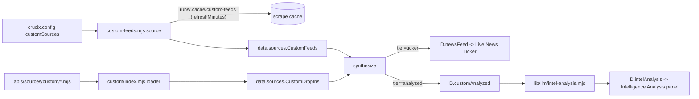

# Custom OSINT Sources Guide

Add your own RSS feeds, scraped web pages (via [Firecrawl](https://firecrawl.dev)), or any HTTP-JSON endpoint to the Crucix OSINT stream without touching core code.

---

## TL;DR

- Edit `customSources` in [crucix.config.mjs](crucix.config.mjs). Each entry has a `type` (`rss` / `firecrawl` / `http-json`) and a `tier`.
- **`tier: 'ticker'`** -> joins the existing news ticker, no LLM cost.
- **`tier: 'analyzed'`** -> saved into the sweep, fed to a separate "Intelligence Analysis" LLM panel.
- For anything weirder than the three built-in types, drop a `.mjs` file into [apis/sources/custom/](apis/sources/custom/) and it is auto-discovered.
- Test one source live: `docker compose exec crucix npm run test:custom-source -- "Source Name"`

---

## Mental model



Two completely independent paths once an item is classified by tier:

| Tier | Where it appears | LLM cost | Persisted to `runs/latest.json` |
| ---- | ---------------- | -------- | ------------------------------- |
| `ticker` | Live News Ticker card (and globe markers if you supply lat/lon) | None | Yes (under `data.sources.CustomFeeds.itemsTicker`) |
| `analyzed` | Intelligence Analysis panel (LLM-summarized) | One call per sweep, ~2K tokens | Yes (under `data.sources.CustomFeeds.itemsAnalyzed`) |

The existing hardcoded RSS feed list in [dashboard/inject.mjs](dashboard/inject.mjs) is untouched. Custom sources layer **on top** of it.

---

## Adding an RSS feed

Open [crucix.config.mjs](crucix.config.mjs) and add to `customSources`:

```js
customSources: [
  {
    type: 'rss',
    name: 'Reuters Politics',
    url: 'https://www.reuters.com/arc/outboundfeeds/v3/category/politics/?outputType=xml',
    tier: 'ticker',                // 'ticker' or 'analyzed'
    region: 'Americas',            // free-form, shown in ticker / panel
    refreshMinutes: 30,            // optional; default 30 for RSS
    tags: ['politics', 'us'],      // optional
  },
],
```

Rebuild and restart:

```powershell
docker compose up -d --build
docker compose logs -f crucix
```

After the next sweep you should see your feed's items mixed into the Live News Ticker. The first 30 items per feed per sweep are kept; the global ticker is still capped at 50 items.

### Verify just this source

```powershell
docker compose exec crucix npm run test:custom-source -- "Reuters Politics"
```

Bypasses the cache and prints the first item plus an Intel-readiness check.

---

## Adding a Firecrawl scrape

[Firecrawl](https://firecrawl.dev) lets you scrape any web page into clean markdown. It is paid (~500 credits/mo free tier, ~1 credit per scrape).

### 1. Get an API key

Sign up at [firecrawl.dev](https://firecrawl.dev), copy the key.

### 2. Add it to `.env`

```ini
FIRECRAWL_API_KEY=fc-xxxxxxxx
# Optional cap, defaults to 5
FIRECRAWL_MAX_PER_SWEEP=5
```

### 3. Add a source to `crucix.config.mjs`

```js
customSources: [
  {
    type: 'firecrawl',
    name: 'KP State Press',
    url: 'https://kp.gov.pk/press_releases',
    tier: 'analyzed',
    region: 'Asia',
    refreshMinutes: 120,                       // every 2h; defaults to 120
    firecrawl: {
      formats: ['markdown'],                   // default
      onlyMainContent: true,                   // default true
    },
    tags: ['gov', 'official'],
  },
],
```

Markdown content is fed to the Intel Analysis LLM (cap of 600 chars per item, 4500 chars total across all analyzed sources).

### Free-tier math

With the default cap (`FIRECRAWL_MAX_PER_SWEEP=5`) and a 15-minute sweep cadence:

| Sources scraped per sweep | Credits/day | Credits/month |
| ------------------------- | ----------- | ------------- |
| 1 source, `refreshMinutes: 60`   | ~24  | ~720  (over free tier) |
| 1 source, `refreshMinutes: 120`  | ~12  | ~360  |
| 1 source, `refreshMinutes: 240`  | ~6   | ~180  |
| 5 sources, `refreshMinutes: 120` | ~60  | ~1800 (paid tier) |

The on-disk cache (`runs/.cache/custom-feeds/`) is honored across container rebuilds because `runs/` is bind-mounted in [docker-compose.yml](docker-compose.yml).

---

## Adding an HTTP-JSON endpoint

For any REST API that returns JSON. No auth helpers built in; bake any required tokens into the URL or use a drop-in module (below) if you need custom headers.

```js
customSources: [
  {
    type: 'http-json',
    name: 'My News API',
    url: 'https://api.example.com/v1/articles?limit=20',
    tier: 'analyzed',
    region: 'Global',
    refreshMinutes: 15,
    json: {
      itemsPath: 'data.articles',     // dotted path; '' means root array
      titleField: 'headline',         // default 'title'
      urlField: 'permalink',          // default 'url'
      dateField: 'published_at',      // default 'date'
      contentField: 'summary',        // optional; required for analyzed tier to be useful
    },
  },
],
```

---

## Writing a drop-in module

For anything weird: custom headers, OAuth, GraphQL, scraping with a specific parser, etc. Drop a `.mjs` file into [apis/sources/custom/](apis/sources/custom/) and it is auto-discovered on next sweep.

### Contract

```js
// apis/sources/custom/my-thing.mjs
export async function briefing() {
  // Do whatever you want here.
  // Return { itemsTicker: [...], itemsAnalyzed: [...] }.
  return {
    itemsTicker: [
      {
        name: 'My Thing',
        title: 'Something happened',
        url: 'https://example.com/post/1',
        timestamp: new Date().toISOString(),
        region: 'Global',
        tags: ['custom'],
      },
    ],
    itemsAnalyzed: [
      {
        name: 'My Thing Deep',
        title: 'A longer item with content',
        url: 'https://example.com/post/2',
        timestamp: new Date().toISOString(),
        region: 'Europe',
        tags: ['custom', 'deep'],
        content: 'Up to ~600 chars of body text the LLM can analyze...',
      },
    ],
  };
}
```

That is the entire API. Each drop-in is wrapped in its own 25s timeout and try/catch, so one bad file cannot break the others. Failures are reported in `data.sources.CustomDropIns.errors`.

---

## How the Intelligence Analysis panel works

The "Intelligence Analysis" panel in the lower grid is fed by [lib/llm/intel-analysis.mjs](lib/llm/intel-analysis.mjs).

- Runs **after** every sweep.
- Skipped entirely if `LLM_PROVIDER` is not set OR if `customAnalyzed` is empty.
- Sends up to the 12 most-recent analyzed items (sorted by `timestamp` desc), capped at 4500 chars total of context.
- Adds a small DELTA_SUMMARY block so the model can weight recently changing topics higher.
- Returns 3-6 standalone intelligence items with `title`, `summary`, `region`, `confidence`, `tags`, `sources`.

Panel states:

| State | Reason | What to do |
| ----- | ------ | ---------- |
| `NO INPUT` | No analyzed-tier sources configured | Add a source with `tier: 'analyzed'` |
| `LLM NOT CONFIGURED` | Analyzed items exist but no LLM | Set `LLM_PROVIDER` in `.env` |
| `RETRY NEXT SWEEP` | LLM call failed last cycle | Usually transient; check logs |
| `AI ENHANCED` (badge) | Working normally | nothing |

Trade-ideas (the existing "Leverageable Ideas" panel) and Intel Analysis are completely separate pipelines. They share the LLM provider but use distinct prompts and budgets.

---

## Troubleshooting

**Source returns 0 items.**

```bash
docker compose exec crucix npm run test:custom-source -- "Source Name"
```

Will show the underlying fetch error.

**Source is cached and I want to see fresh data right now.**

Two options:

```bash
docker compose exec crucix npm run test:custom-source -- "Source Name"   # bypasses cache
docker compose exec crucix rm runs/.cache/custom-feeds/*.json            # nukes all cache
```

Then trigger a sweep with `/sweep` in Telegram or `docker compose restart crucix`.

**RSS parses 0 items but I can open the feed in a browser.**

The regex-based parser supports standard RSS 2.0 and Atom. If the feed is malformed, wrap it in a drop-in module that uses a real XML parser like `fast-xml-parser`.

**Intel Analysis panel shows "NO ANALYSIS YET" forever.**

Check `docker compose logs crucix | Select-String "Intel Analysis"`. Likely causes:

- LLM provider not configured (`LLM_PROVIDER` not set).
- Analyzed sources returning items with empty `content` — the LLM needs text to work with. Run the test script and look for "Intel-readiness: WEAK".

**Firecrawl burning credits.**

Lower `FIRECRAWL_MAX_PER_SWEEP` in `.env` and bump `refreshMinutes` per source. The hard cap is enforced **before** any cache lookup, so configured sources with valid cache hits still count toward the budget; if you hit the cap with no cache, sources are skipped (logged as errors).

**Drop-in module errors do not crash the sweep.**

By design. Look in `runs/latest.json` -> `sources.CustomDropIns.errors` (or just `docker compose logs crucix`) for per-file error messages.

---

## Files involved

| File | Role |
| ---- | ---- |
| [crucix.config.mjs](crucix.config.mjs) | Declarative `customSources` array + `firecrawl` block |
| [apis/sources/custom-feeds.mjs](apis/sources/custom-feeds.mjs) | RSS / Firecrawl / HTTP-JSON dispatcher + cache |
| [apis/sources/custom/index.mjs](apis/sources/custom/index.mjs) | Auto-discovery of drop-in `.mjs` modules |
| [lib/llm/intel-analysis.mjs](lib/llm/intel-analysis.mjs) | LLM synthesis prompt + parsing |
| [dashboard/inject.mjs](dashboard/inject.mjs) | Splits `customTicker` / `customAnalyzed`, merges ticker into news feed |
| [dashboard/public/jarvis.html](dashboard/public/jarvis.html) | Renders the Intelligence Analysis panel |
| [scripts/test-custom-source.mjs](scripts/test-custom-source.mjs) | `npm run test:custom-source` debug helper |

---

## Related docs

| Doc | Purpose |
| --- | ------- |
| [README.md](README.md) | Project overview |
| [TELEGRAM_ALERTS.md](TELEGRAM_ALERTS.md) | Alert tiers, daily brief |
| [DEPLOY_LINODE.md](DEPLOY_LINODE.md) | Run Crucix on a VPS |
| [FORK_MAINTENANCE.md](FORK_MAINTENANCE.md) | Sync your fork with upstream |

---

## After any change, rebuild

Source files are baked into the Docker image. After editing `crucix.config.mjs`, a drop-in module, or any code:

```powershell
docker compose up -d --build
```

A plain `docker compose restart` is **not** enough.
