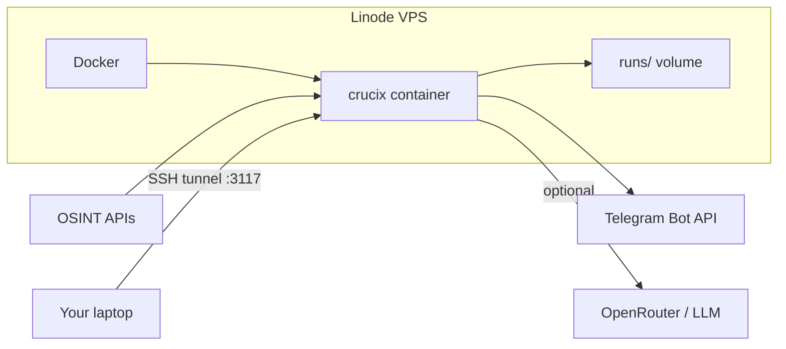

# Deploy Crucix on Linode

Run Crucix 24/7 on a small Linode VPS so Telegram alerts, sweeps, and the daily brief keep working when your laptop sleeps.

---

## TL;DR

- **Plan:** Linode Nanode 1GB (~$5/mo), Ubuntu 24.04 LTS, region near you (e.g. Newark for US East).
- **Deploy:** `git clone` your fork → copy `.env` → `docker compose up -d --build`.
- **Dashboard:** use an SSH tunnel (`ssh -L 3117:localhost:3117`) — do not expose port 3117 to the public internet without auth.
- **Updates:** `git fetch upstream && git merge upstream/master && docker compose up -d --build` (see [FORK_MAINTENANCE.md](FORK_MAINTENANCE.md)).
- **Alerts:** already documented in [TELEGRAM_ALERTS.md](TELEGRAM_ALERTS.md); test with `docker compose exec crucix npm run test:telegram`.

---

## Why Linode (and this plan)

Crucix is **network-bound**, not CPU-bound. Each sweep hits ~29 HTTP APIs, synthesizes JSON, and optionally calls an LLM. Steady-state RAM is typically **150–300 MB** inside Docker.

| Plan              | RAM   | Approx. cost | Good for Crucix?                          |
| ----------------- | ----- | ------------ | ----------------------------------------- |
| Nanode 1GB        | 1 GB  | ~$5/mo       | **Yes** — recommended default             |
| Linode 2GB        | 2 GB  | ~$12/mo      | Headroom if you add more services         |
| Linode 4GB+       | 4 GB+ | $24+/mo      | Only if you run a **local** LLM (Ollama)  |

Skip Linode Kubernetes (LKE) and managed PaaS wrappers — `docker compose` on a single VM is simpler and matches how the repo is built ([docker-compose.yml](docker-compose.yml), [Dockerfile](Dockerfile)).



---

## Prerequisites

On your **local machine** (Windows):

- SSH client (built into Windows 10/11, or Git Bash).
- An SSH key pair. If you do not have one:

```powershell
ssh-keygen -t ed25519 -C "your-email@example.com"
Get-Content ~/.ssh/id_ed25519.pub
```

Copy the public key — you will paste it into Linode when creating the instance.

On **Linode**:

- A Linode account ([linode.com](https://www.linode.com)).
- Your fork URL (e.g. `https://github.com/byronroark/Crucix.git`) or the upstream repo if you deploy without a fork.

You also need a working `.env` from local development ([.env.example](.env.example)). **Never commit `.env`** — it is gitignored.

---

## Step 1 — Create the Linode

In the Linode Cloud Manager:

| Setting        | Value                                      |
| -------------- | ------------------------------------------ |
| Image          | **Ubuntu 24.04 LTS**                       |
| Region         | Closest to you (e.g. **Newark** / **Atlanta** for US East) |
| Plan           | **Nanode 1GB** (Shared CPU)                |
| Label          | `crucix`                                   |
| Root password  | Strong random password (backup access)     |
| SSH keys       | Paste your **public** key                  |

Create the Linode and note the **IPv4 address** (`<your-linode-ip>`).

---

## Step 2 — First login and harden the server

SSH in as root:

```bash
ssh root@<your-linode-ip>
```

Update packages and create a non-root user:

```bash
apt update && apt upgrade -y

adduser crucix
usermod -aG sudo crucix
rsync --archive --chown=crucix:crucix ~/.ssh /home/crucix
```

Lock down SSH (key-only, no root login):

```bash
sed -i 's/^#\?PermitRootLogin.*/PermitRootLogin no/' /etc/ssh/sshd_config
sed -i 's/^#\?PasswordAuthentication.*/PasswordAuthentication no/' /etc/ssh/sshd_config
systemctl restart ssh
```

Firewall and basic intrusion protection:

```bash
apt install -y ufw fail2ban
ufw allow 22/tcp
ufw --force enable
systemctl enable --now fail2ban
```

Reconnect as the new user:

```bash
exit
ssh crucix@<your-linode-ip>
```

**Do not** open port `3117` in UFW unless you are putting a reverse proxy with authentication in front of the dashboard (see [Optional: public HTTPS dashboard](#optional-public-https-dashboard)).

---

## Step 3 — Install Docker

On the Linode (as `crucix`):

```bash
curl -fsSL https://get.docker.com | sudo sh
sudo usermod -aG docker $USER
```

Log out and back in so the `docker` group applies:

```bash
exit
ssh crucix@<your-linode-ip>
docker --version
docker compose version
```

---

## Step 4 — Deploy Crucix

### Clone your fork

```bash
cd ~
git clone https://github.com/<your-username>/Crucix.git
cd Crucix
```

If you use the upstream repo directly, clone `https://github.com/calesthio/Crucix.git` instead — but you will not have your fork-only commits unless you merge them separately.

### Copy `.env` from your Windows machine

From **PowerShell on your PC** (repo root):

```powershell
scp .env crucix@<your-linode-ip>:~/Crucix/.env
```

Or create it on the server:

```bash
cp .env.example .env
nano .env
```

Fill in at minimum whatever you use locally: API keys, `TELEGRAM_BOT_TOKEN`, `TELEGRAM_CHAT_ID`, and optionally:

```ini
TELEGRAM_DAILY_BRIEF_TIME=07:00
TELEGRAM_DAILY_BRIEF_TZ=America/New_York
REFRESH_INTERVAL_MINUTES=15
PORT=3117
```

Remember: **no inline comments on the same line as values** — Docker's `env_file` parser treats them as part of the value.

### Build and start

```bash
docker compose up -d --build
docker compose logs -f crucix
```

Wait until you see a line like `Sweep complete` (first sweep can take 20–40 seconds). Press `Ctrl+C` to stop tailing logs (the container keeps running).

### Verify Telegram

```bash
docker compose exec crucix npm run test:telegram
```

You should receive a blue ROUTINE test message in Telegram within a few seconds. Full alert behavior is documented in [TELEGRAM_ALERTS.md](TELEGRAM_ALERTS.md).

Send `/status` to your bot from your phone — it should reply with uptime and source counts.

---

## Step 5 — Use the dashboard from your laptop

The dashboard has **no built-in login**. The safe default is an SSH tunnel.

On **Windows PowerShell** (leave this window open while browsing):

```powershell
ssh -N -L 3117:localhost:3117 crucix@<your-linode-ip>
```

Open in your browser:

```
http://localhost:3117
```

Hard-refresh after deploys: `Ctrl + Shift + R`.

---

## Day-to-day operations

### View logs

```bash
cd ~/Crucix
docker compose logs -f crucix          # follow
docker compose logs --tail=100 crucix  # last 100 lines
```

### Restart vs rebuild

| Command                         | When to use it                                      |
| ------------------------------- | --------------------------------------------------- |
| `docker compose restart crucix` | Env-only change in `.env` (no code change)          |
| `docker compose up -d --build`  | **Any code change** — image must be rebuilt         |

Source is copied into the image at build time (`COPY . .` in [Dockerfile](Dockerfile)). **`restart` alone does not pick up new JavaScript/HTML.**

### Pull updates (fork + upstream)

See [FORK_MAINTENANCE.md](FORK_MAINTENANCE.md). On the Linode:

```bash
cd ~/Crucix
git fetch upstream
git merge upstream/master
# resolve conflicts if any
git push                    # updates your fork on GitHub
docker compose up -d --build
docker compose logs -f crucix
```

### Change configuration

1. Edit `.env` on the server (`nano .env`).
2. `docker compose up -d` (restart is enough for env-only changes).

---

## Optional: public HTTPS dashboard

Only do this if you want a URL you can open without an SSH tunnel. **Require authentication** — the dashboard exposes live intelligence data.

Example with [Caddy](https://caddyserver.com/) (automatic HTTPS):

```bash
sudo apt install -y caddy
sudo caddy hash-password
# Copy the hash output

sudo nano /etc/caddy/Caddyfile
```

```caddyfile
crucix.yourdomain.com {
    reverse_proxy localhost:3117
    basicauth {
        admin <paste-hash-here>
    }
}
```

```bash
sudo systemctl restart caddy
sudo ufw allow 80/tcp
sudo ufw allow 443/tcp
```

Point your domain's **A record** at `<your-linode-ip>`. Do **not** expose raw port `3117` publicly.

---

## Backups and state

Persistent data lives in **`runs/`** on the host (bind-mounted in [docker-compose.yml](docker-compose.yml)):

- `runs/latest.json` — last raw sweep
- `runs/memory/` — delta history and alert dedup state

### What happens if you lose `runs/`?

Crucix regenerates on the next sweep. You lose short-term delta context until a few sweeps rebuild history — alerts may be noisier for an hour.

### Backup options

**Manual (free):**

```powershell
# From Windows — download the runs folder
scp -r crucix@<your-linode-ip>:~/Crucix/runs ./crucix-runs-backup
```

**Linode Backups (~$2/mo):** enable in Cloud Manager → Backups on the Linode. Full VM snapshots; easy restore.

---

## Monitoring

Crucix does not ship a separate health UI for the VPS itself. Simple options:

| Method              | What it checks                          | Cost   |
| ------------------- | --------------------------------------- | ------ |
| Daily Telegram brief| "Did Crucix run today at 7am?"          | Free   |
| UptimeRobot TCP     | Port 22 reachable                       | Free   |
| `docker compose ps` | Container up                            | Manual |

If the daily brief stops arriving, SSH in and check `docker compose logs crucix`.

---

## Cost summary

| Item                    | Monthly (approx.) |
| ----------------------- | ----------------- |
| Linode Nanode 1GB       | $5                |
| Linode Backups (opt.)   | $2                |
| Domain (opt., HTTPS)    | ~$1               |
| OpenRouter / LLM usage  | Variable (usually cents) |

---

## Troubleshooting

**Container exits immediately.**

```bash
docker compose logs crucix
```

Common causes: invalid `.env` syntax (inline comments), port 3117 already in use, or out of memory on a undersized plan.

**Telegram bot does not respond to `/status`.**

1. Confirm token and chat ID in `.env`.
2. `docker compose exec crucix npm run test:telegram`
3. Check logs for `[Telegram] Bot command polling started`.

**Dashboard works via tunnel but data looks stale.**

Force a sweep: send `/sweep` in Telegram, or:

```bash
docker compose restart crucix
docker compose logs -f crucix
```

**Code changes on GitHub not reflected on the server.**

You must rebuild:

```bash
git pull
docker compose up -d --build
```

**Out of disk space.**

```bash
df -h
docker system prune -f   # removes unused images — safe if you only run Crucix
```

**Cannot SSH after hardening.**

Use Linode Cloud Manager → **Launch LISH Console** to fix `/etc/ssh/sshd_config` or restore your key in `~/.ssh/authorized_keys`.

---

## Quick reference cheat sheet

```bash
# --- On Linode ---
ssh crucix@<your-linode-ip>
cd ~/Crucix

docker compose ps
docker compose logs -f crucix
docker compose up -d --build          # deploy / update code
docker compose exec crucix npm run test:telegram

git fetch upstream && git merge upstream/master && git push
```

```powershell
# --- On Windows ---
scp .env crucix@<your-linode-ip>:~/Crucix/.env
ssh -N -L 3117:localhost:3117 crucix@<your-linode-ip>
# browser: http://localhost:3117
```

---

## Things to never do

- **Never commit or push `.env`.** It contains API keys and your Telegram bot token.
- **Never expose port 3117 to the internet without authentication.** Use an SSH tunnel or HTTPS + basic auth.
- **Never run `docker compose restart` after pulling code** — use `docker compose up -d --build`.
- **Never store secrets in the Docker image.** Keep them in `.env` on the server only.
- **Never disable the firewall entirely.** At minimum keep SSH (22) restricted; add 80/443 only if using Caddy.

---

## Related docs

| Doc | Purpose |
| --- | ------- |
| [FORK_MAINTENANCE.md](FORK_MAINTENANCE.md) | Sync your fork with upstream calesthio/Crucix |
| [TELEGRAM_ALERTS.md](TELEGRAM_ALERTS.md) | Alert tiers, commands, daily brief, tuning |
| [.env.example](.env.example) | All configuration variables |
| [README.md](README.md) | Project overview and local Docker quick start |

---

## After deploy: shut down local Docker (optional)

Once Linode is healthy, you can stop the Windows instance to avoid duplicate sweeps and duplicate Telegram alerts:

```powershell
docker compose down
```

Only one instance should use the same `TELEGRAM_CHAT_ID` if you want a single alert stream.
