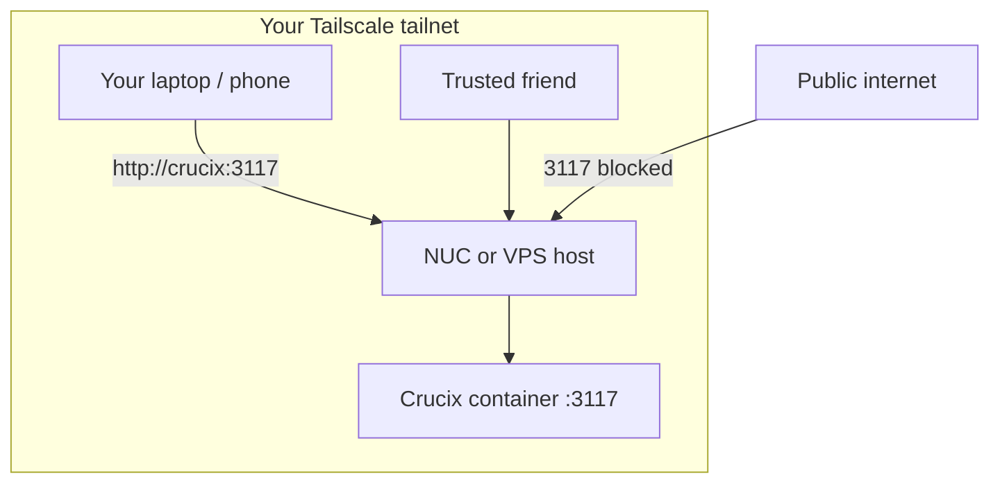

# Private Dashboard Access with Tailscale

Reach your Crucix dashboard from anywhere **without** exposing port 3117 to the public internet — and invite a trusted friend or two without OpenVPN files or router port-forwarding.

Crucix has **no built-in login**. Tailscale controls **who can reach the host** on your private tailnet. Anyone you invite can open the full dashboard once connected.

---

## TL;DR

1. Install Tailscale on the **host** where Crucix runs (NUC or VPS) — not inside the Docker container.
2. Set the machine name to `crucix` and enable **MagicDNS** in the [Tailscale admin console](https://login.tailscale.com/admin/dns).
3. Block public access to port **3117** with UFW (keep SSH and Tailscale working).
4. On your laptop/phone: install Tailscale → open `http://crucix:3117`.
5. Invite friends: [Users](https://login.tailscale.com/admin/settings/users) → **Invite** (free Personal plan: up to **6 users**).

No changes to `docker-compose.yml`. No Crucix rebuild required for Tailscale itself.

---

## Why Tailscale (vs SSH tunnel or OpenVPN)

| Approach | Friend access | Home router | Repo changes |
| -------- | ------------- | ----------- | ------------ |
| SSH tunnel | Awkward (share SSH or tunnel instructions) | None | Already documented |
| OpenVPN | Send `.ovpn` files, port-forward UDP 1194 | Port forward | Extra Docker service |
| **Tailscale** | Email invite | **None** | **This guide only** |

**Cost:** [Tailscale Personal](https://tailscale.com/pricing) is **$0** for non-commercial homelab use (up to 6 users, unlimited devices).

---

## Architecture



Tailscale encrypts traffic between devices (WireGuard). Crucix still speaks plain HTTP on port 3117 **inside** the tailnet — that is fine for a small trusted group (see [HTTP on Tailscale](#http-on-tailscale-does-it-matter)).

---

## Step 1 — Install Tailscale on the Crucix host

On the **NUC or VPS** (Ubuntu/Debian), as a user with `sudo`:

```bash
curl -fsSL https://tailscale.com/install.sh | sh
sudo tailscale up
```

Sign in with Google, GitHub, Microsoft, or a passkey. Confirm the node appears at [login.tailscale.com/admin/machines](https://login.tailscale.com/admin/machines).

### Set a friendly hostname

```bash
sudo tailscale set --hostname=crucix
```

Or in the admin console: **Machines** → **⋯** → **Edit machine name** → `crucix`.

Uncheck **Auto-generate from OS hostname** if you do not want the name to change when the OS hostname changes.

---

## Step 2 — Enable MagicDNS

1. Open [login.tailscale.com/admin/dns](https://login.tailscale.com/admin/dns)
2. Click **Enable MagicDNS**
3. Note your **tailnet DNS name** (e.g. `your-tailnet.ts.net`)

After MagicDNS is on, devices on your tailnet can use:

| URL | Notes |
| --- | ----- |
| `http://crucix:3117` | Short name (requires Tailscale DNS on the client) |
| `http://crucix.your-tailnet.ts.net:3117` | Full name — always works on the tailnet |

MagicDNS resolves the **hostname only** — you still need **`:3117`** for the Crucix port.

### Optional — `PUBLIC_URL` for Telegram / Discord `/status`

In `.env` on the host:

```ini
PUBLIC_URL=http://crucix:3117
```

Only useful on devices that resolve MagicDNS (i.e. connected to your tailnet). See [crucix.config.mjs](crucix.config.mjs).

---

## Step 3 — Lock down port 3117 on the public internet

Crucix can keep publishing `3117:3117` in Docker. **UFW on the host** stops the open internet from reaching it.

```bash
sudo ufw allow 22/tcp comment 'SSH'
sudo ufw allow 41641/udp comment 'Tailscale'
sudo ufw deny 3117/tcp comment 'Block public Crucix dashboard'
sudo ufw enable
sudo ufw status
```

Tailscale does **not** require opening port 3117 publicly — clients connect over the encrypted tailnet.

### Optional — LAN access on a home NUC

If you still want `http://192.168.x.x:3117` from home Wi‑Fi **without** Tailscale:

```bash
sudo ufw allow from 192.168.0.0/16 to any port 3117 proto tcp comment 'Crucix LAN'
```

Do **not** run `ufw allow 3117` for `any` — that exposes the dashboard to the world.

### Other Docker apps or host services on the same machine

If the host runs **more than Crucix** — other `docker compose` stacks, standalone containers, or native daemons that publish ports — those ports are **not** covered by the `3117` rules above. Audit what is listening:

```bash
docker ps --format 'table {{.Names}}\t{{.Ports}}'
sudo ss -tlnp | grep LISTEN
```

For **each published host port** (the number before `->` in Docker, e.g. `0.0.0.0:8080->8080/tcp` means port **8080**):

1. **Block the public internet** (same idea as Crucix).
2. Decide who should reach it: **LAN only**, **Tailscale**, or **localhost** — not all three by default.

**LAN only** (home Wi‑Fi, not Tailscale, not the internet) — typical for admin UIs you only use at home:

```bash
# Replace PORT with the host port (example: 8080)
sudo ufw deny PORT/tcp comment 'Block public access'
sudo ufw allow from 192.168.0.0/16 to any port PORT proto tcp comment 'LAN only'
```

- Reachable at home: `http://192.168.x.x:PORT`
- **Not** on Tailscale unless you add a separate rule (see below)
- Friends on your tailnet cannot hit it if you skip the tailnet rule
- Do **not** port-forward that port on your router

**Optional — same service over Tailscale** (only if you need remote access; anyone on your tailnet can use it):

```bash
sudo ufw allow from 100.64.0.0/10 to any port PORT proto tcp comment 'Via Tailscale'
```

Skip this if the service should stay LAN-only. Many homelab apps have weak or no auth — treat unexpected exposure like leaving an admin panel on the open internet.

### VPS note

Also close port 3117 in the **cloud provider firewall** if you use one. Only **22/tcp** (SSH) and Tailscale need to be reachable from the internet.

---

## Step 4 — Use the dashboard

1. Install [Tailscale](https://tailscale.com/download) on your laptop or phone.
2. Sign in to the **same tailnet** as the Crucix host.
3. Ensure **Use Tailscale DNS** is enabled in the Tailscale app (default on most platforms).
4. Open:

```
http://crucix:3117
```

Verify health:

```bash
curl http://crucix:3117/api/health
```

From a device **not** on Tailscale, the same URL should **fail** (and public IP `:3117` should be refused).

---

## Step 5 — Invite a trusted friend

1. [login.tailscale.com/admin/settings/users](https://login.tailscale.com/admin/settings/users) → **Invite users**
2. Friend accepts the email and installs Tailscale.
3. They open `http://crucix:3117` (or the full MagicDNS name).

**Revoke access:** remove them in the admin console — no certificate files to rotate.

Free Personal plan supports up to **6 users** — plenty for you plus one or two friends.

---

## HTTP on Tailscale: does it matter?

**In transit:** Yes, Tailscale encrypts traffic (WireGuard). `http://crucix:3117` over the tailnet is **not** the same as exposing HTTP on a public IP.

**Access control:** Crucix has no app login. Anyone on your tailnet can view the dashboard. You control access by **who you invite**, not by HTTP vs HTTPS.

| Setup | Wire encryption | Who can see the dashboard |
| ----- | --------------- | ------------------------- |
| `http://crucix:3117` on Tailscale | Yes | Anyone on your tailnet |
| `http://public-ip:3117` | **No** | The whole internet — avoid |

For a homelab shared with trusted friends, HTTP over Tailscale is a common and reasonable choice.

---

## Optional — Tailscale Serve (HTTPS)

If you want `https://crucix` without exposing port 3117, on the **host**:

```bash
sudo tailscale serve --bg --https=443 http://127.0.0.1:3117
```

Tailnet members open `https://crucix` (exact URL shown by `tailscale serve status`). Optional — plain `http://crucix:3117` is enough for most setups.

---

## NUC vs VPS checklist

| Step | Home NUC | Linode / VPS |
| ---- | -------- | -------------- |
| Install Tailscale | `install.sh` on NUC | Same on VPS |
| Crucix | `docker compose up -d --build` | Same |
| Router port forward | **Not needed** | N/A |
| UFW deny 3117 | Recommended | Recommended |
| Friend URL | `http://crucix:3117` | Same |

---

## Troubleshooting

**`crucix` does not resolve**

- Use the full name from **Machines** in the admin console: `http://crucix.your-tailnet.ts.net:3117`
- Confirm MagicDNS is enabled and the client uses Tailscale DNS.

**Dashboard works on LAN but not via Tailscale**

- `tailscale status` on host — node should be connected.
- From client: `ping crucix` or `curl http://100.x.y.z:3117/api/health` using the host's Tailscale IP from `tailscale status`.

**Friend cannot connect**

- Confirm they accepted the invite and appear under **Users**.
- They must use the same tailnet — not their own personal tailnet.

**Telegram bot `/status` shows localhost**

- Set `PUBLIC_URL=http://crucix:3117` in `.env` and `docker compose up -d`.

---

## Related docs

| Doc | Purpose |
| --- | ------- |
| [DEPLOY_LINODE.md](DEPLOY_LINODE.md) | VPS deploy, SSH tunnel alternative, `.env` copy |
| [README.md](README.md) | NUC Docker deploy, env vars |
| [TELEGRAM_ALERTS.md](TELEGRAM_ALERTS.md) | Bot setup — works over Tailscale unchanged |
| [FORK_MAINTENANCE.md](FORK_MAINTENANCE.md) | Pull updates after doc changes |

---

## Alternatives

- **SSH tunnel** — [DEPLOY_LINODE.md](DEPLOY_LINODE.md) Step 5; best for solo use, no friend invites.
- **Caddy + basic auth on 443** — public HTTPS with password; see DEPLOY_LINODE optional section.
- **OpenVPN** — self-hosted; more ops than Tailscale for 1–2 friends.
