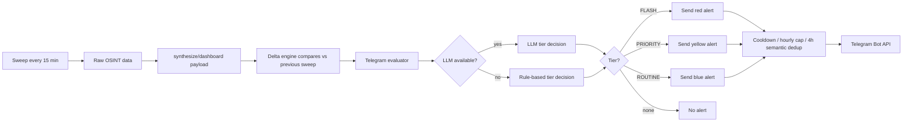

# Telegram Alerts Guide

Complete reference for Crucix Telegram alerts: initial setup, features, tuning, deployment, and troubleshooting.

---

## TL;DR

- Alerts fire automatically after every sweep (every `REFRESH_INTERVAL_MINUTES`, default 15).
- **LLM is optional** for alerts — rule-based evaluation runs when the LLM is off or fails.
- The bot answers commands: `/status`, `/sweep`, `/brief`, `/alerts`, `/mute`, `/unmute`, `/help`.
- Send a manual test any time: `npm run test:telegram` (or via Docker — see [Testing](#testing-the-wiring-end-to-end)).
- Optional scheduled daily brief: set `TELEGRAM_DAILY_BRIEF_TIME` in `.env`.
- **Run only one Crucix instance** per `TELEGRAM_CHAT_ID` or you get duplicate alerts.

### In this doc

| Section | Topics |
| ------- | ------ |
| [Setup plan](#setup-plan-zero-to-working) | BotFather, chat ID, `.env`, deploy, verify |
| [Feature inventory](#feature-inventory) | Everything implemented in this fork |
| [Configuration reference](#configuration-reference) | All env vars |
| [How alerts get triggered](#how-alerts-get-triggered) | Pipeline diagram |
| [Alert tiers](#alert-tiers) | FLASH / PRIORITY / ROUTINE |
| [Bot commands](#bot-commands) | `/status`, `/mute`, etc. |
| [Daily brief](#scheduled-daily-brief-opt-in) | Scheduled digest |
| [Tuning recipes](#tuning-recipes) | Quieter / wider net presets |
| [Troubleshooting](#troubleshooting) | Common failures |

---

## Setup plan (zero to working)

Follow these steps once when wiring Telegram for the first time (Windows Docker, NUC, or Linode — same `.env` + same test commands).

### Step 1 — Create the bot

1. Open Telegram and message [@BotFather](https://t.me/BotFather).
2. Send `/newbot`, pick a display name and username (must end in `bot`).
3. Copy the **HTTP API token** BotFather returns (format: `123456789:ABCdef...`).

Optional: `/setcommands` in BotFather is not required — Crucix registers commands scoped to your chat on startup.

### Step 2 — Get your chat ID

1. Message [@userinfobot](https://t.me/userinfobot) (or add your bot to a group and use a group-ID bot).
2. Copy your numeric **Id** — e.g. `123456789` (not `@username`).

For a **group** chat: add the bot to the group, send a message, then inspect updates:

```bash
curl "https://api.telegram.org/bot<YOUR_TOKEN>/getUpdates"
```

Use the `chat.id` from the JSON (groups are negative numbers like `-1001234567890`).

### Step 3 — Configure `.env`

Copy [.env.example](.env.example) to `.env` if needed. Set:

```ini
TELEGRAM_BOT_TOKEN=123456789:ABCdefGHI...
TELEGRAM_CHAT_ID=123456789

# Optional — daily digest at 7:00 AM Eastern
TELEGRAM_DAILY_BRIEF_TIME=07:00
TELEGRAM_DAILY_BRIEF_TZ=America/New_York

# Optional — bot command poll interval (ms). Default 5000.
TELEGRAM_POLL_INTERVAL=5000

# Optional — extra Telegram channels for OSINT ingestion (comma-separated)
# TELEGRAM_CHANNELS=
```

Rules:

- **No inline comments on the same line as values** — Docker `env_file` treats `# comment` as part of the value.
- `.env` is gitignored — never commit it.

Values flow into [crucix.config.mjs](crucix.config.mjs) → `config.telegram` → [lib/alerts/telegram.mjs](lib/alerts/telegram.mjs).

### Step 4 — Deploy and confirm startup logs

**Docker (Windows, NUC, Linode):**

```bash
docker compose up -d --build
docker compose logs -f crucix
```

Look for:

```
[Crucix] Telegram alerts enabled
[Telegram] Bot command polling started
[Crucix] Daily brief scheduled for 07:00 (America/New_York) — first fire at ...
```

If you only see `Telegram alerts enabled` but no polling line, the token may be invalid.

### Step 5 — Verify delivery

```bash
docker compose exec crucix npm run test:telegram
```

You should receive a blue **ROUTINE** test message within a few seconds. Then send **`/status`** to the bot from Telegram — it should reply with uptime and source counts.

### Step 6 — Cut over from another machine (important)

If you move Crucix from a Windows PC to a NUC (or Linode), **stop the old instance first**:

```bash
docker compose down   # on the old host
```

Only one running instance should use the same `TELEGRAM_CHAT_ID`, or every sweep sends duplicate tiered alerts and daily briefs.

---

## Feature inventory

Everything the Telegram integration provides in this fork:

| Feature | Description | Requires LLM? |
| ------- | ----------- | ------------- |
| **Reactive tiered alerts** | FLASH / PRIORITY / ROUTINE after each sweep when delta signals qualify | No (LLM enhances when configured) |
| **Rule-based fallback** | Deterministic tier logic when LLM is off or errors | No |
| **Semantic dedup** | SHA-256 content hash; suppresses near-duplicate alerts for 4 hours | No |
| **Per-tier rate limits** | Cooldown + max alerts per hour per tier | No |
| **Signal memory** | Marks alerted signals in `runs/memory/` to avoid repeat pings | No |
| **Two-way bot commands** | `/status`, `/sweep`, `/brief`, `/portfolio`, `/alerts`, `/mute`, `/unmute`, `/help` | No |
| **Chat-scoped security** | Commands only accepted from `TELEGRAM_CHAT_ID` | No |
| **Command menu registration** | `setMyCommands` scoped to your chat (not global discovery) | No |
| **Scheduled daily brief** | Once-daily digest at `TELEGRAM_DAILY_BRIEF_TIME` + optional TZ | No |
| **Long message splitting** | `/brief` and daily brief split at 4096 chars (Telegram limit) | No |
| **Manual test script** | `npm run test:telegram [FLASH\|PRIORITY\|ROUTINE]` bypasses rate limits | No |
| **Discord parity** | Same delta pipeline can mirror to Discord ([lib/alerts/discord.mjs](lib/alerts/discord.mjs)) | No |

**Not yet implemented (fork roadmap):** custom OSINT source items triggering delta/Telegram alerts — see [README.md](README.md) fork roadmap.

---

## Configuration reference

| Variable | Required | Default | Purpose |
| -------- | -------- | ------- | ------- |
| `TELEGRAM_BOT_TOKEN` | Yes | — | Bot API token from @BotFather |
| `TELEGRAM_CHAT_ID` | Yes | — | Numeric chat or group ID |
| `TELEGRAM_POLL_INTERVAL` | No | `5000` | Bot `getUpdates` poll interval (ms) |
| `TELEGRAM_CHANNELS` | No | — | Extra OSINT channel IDs (comma-separated) for [apis/sources/telegram.mjs](apis/sources/telegram.mjs) |
| `TELEGRAM_DAILY_BRIEF_TIME` | No | disabled | Daily digest time `HH:MM` (24h) |
| `TELEGRAM_DAILY_BRIEF_TZ` | No | server TZ | IANA timezone for daily brief (e.g. `America/New_York`) |
| `TELEGRAM_DAILY_BRIEF_RESPECT_MUTE` | No | `false` | If `true`, `/mute` also silences the daily brief |
| `REFRESH_INTERVAL_MINUTES` | No | `15` | Sweep cadence (drives alert frequency) |
| `LLM_PROVIDER` / `LLM_API_KEY` | No | disabled | Smarter tier decisions when set; not required for alerts |

Delta thresholds (what becomes a “signal”) live in [crucix.config.mjs](crucix.config.mjs) under `config.delta.thresholds` — see [Tuning recipes](#tuning-recipes).

---

## Alert message format

Tiered alerts use Telegram **Markdown** and look like this (example ROUTINE test):

```
🔵 CRUCIX ROUTINE

Test alert from Crucix (ROUTINE)

This is a manual test fired by `npm run test:telegram`. If you can read this,
your bot token, chat ID, and network path are all working.

Confidence: 🟢 HIGH
Direction: MIXED
Cross-correlation: test

💡 Action: No action needed — this is a wiring test.

Signals:
• test_signal_alpha
• test_signal_beta

2026-05-18 04:12:33 UTC
```

| Tier | Emoji | Typical use |
| ---- | ----- | ----------- |
| FLASH | 🔴 | Nuclear anomaly, multi-domain critical events |
| PRIORITY | 🟡 | Escalating clusters, OSINT surges |
| ROUTINE | 🔵 | Single critical or multiple high-severity moves |

---

## Daily brief content

The scheduled brief and `/brief` share [buildBriefBody()](server.mjs) and include:

- Delta summary (risk-off / risk-on / mixed, change counts)
- VIX, WTI, Brent, Gold, Silver, Nat Gas, HY spread
- Top 2 urgent OSINT Telegram posts (if any)
- Top 3 LLM trade ideas (if LLM enabled and ideas exist)

The daily brief **does not** use tier rate limits. By default it **still fires when `/mute` is active** unless `TELEGRAM_DAILY_BRIEF_RESPECT_MUTE=true`.

---

## Deploying on a dedicated server (NUC / VPS)

Same Telegram setup on any always-on host:

1. Copy `.env` to the server (`scp .env user@host:~/Crucix/.env`).
2. `docker compose up -d --build`
3. `docker compose exec crucix npm run test:telegram`
4. Stop any other Crucix instance using the same chat ID.

See [DEPLOY_LINODE.md](DEPLOY_LINODE.md) for VPS hardening and SSH tunnel dashboard access. For private access from you or trusted friends (no port-forwarding), see [DEPLOY_TAILSCALE.md](DEPLOY_TAILSCALE.md). On a home NUC, open `http://<nuc-lan-ip>:3117` from your LAN instead.

**Verify from the NUC:**

```bash
cd ~/Crucix
docker compose exec crucix npm run test:telegram
docker compose logs --tail=30 crucix | grep -i telegram
```

**Verify bot commands:** send `/status` from your phone — response should reflect the NUC uptime, not your old Windows instance.

---

## How alerts get triggered




The pipeline lives in [server.mjs](server.mjs) (sweep loop) and [lib/alerts/telegram.mjs](lib/alerts/telegram.mjs) (evaluator + dedup + bot polling).

---

## Alert tiers


| Tier         | Emoji  | Cooldown | Cap/hr | Fires when                                                                           |
| ------------ | ------ | -------- | ------ | ------------------------------------------------------------------------------------ |
| **FLASH**    | red    | 5 min    | 6      | Nuclear/radiological anomaly, or >=2 critical signals across market + conflict       |
| **PRIORITY** | yellow | 30 min   | 4      | >=2 high/critical signals escalating in the same direction, or OSINT surge (>=5 new) |
| **ROUTINE**  | blue   | 60 min   | 2      | Any single critical signal, or >=3 high-severity signals                             |


Defined in `[TIER_CONFIG](lib/alerts/telegram.mjs)` (~line 15). The same file holds the rule-based fallback (`_ruleBasedEvaluation`) that fires when the LLM is unavailable.

On top of the cooldowns, every alert is deduped against the last 4 hours of message content using a normalized SHA-256 hash, so near-duplicates (same headline, slightly different numbers) won't fire twice.

---

## What counts as a "signal"

The [delta engine](lib/delta/engine.mjs) compares each new sweep against the previous one. A metric becomes a signal once it moves by at least the threshold percentage (numeric) or count (count metric).

### Default thresholds


| Metric              | Threshold   | Source              |
| ------------------- | ----------- | ------------------- |
| VIX                 | +/- 5%      | FRED VIXCLS         |
| HY spread           | +/- 5%      | FRED BAMLH0A0HYM2   |
| 10y-2y spread       | +/- 10%     | FRED T10Y2Y         |
| WTI / Brent crude   | +/- 3%      | EIA / Yahoo Finance |
| Natural gas         | +/- 5%      | EIA / Yahoo Finance |
| Gold                | +/- 2%      | Yahoo Finance       |
| Silver              | +/- 3%      | Yahoo Finance       |
| Unemployment        | +/- 2%      | BLS                 |
| Fed funds           | +/- 1%      | FRED DFF            |
| 10y yield           | +/- 3%      | FRED DGS10          |
| USD index           | +/- 1%      | FRED DTWEXBGS       |
| 30y mortgage        | +/- 2%      | FRED MORTGAGE30US   |
| Urgent OSINT posts  | +/- 2 posts | Telegram channels   |
| Thermal detections  | +/- 500     | NASA FIRMS          |
| Aircraft tracked    | +/- 50      | OpenSky             |
| WHO alerts          | +/- 1       | WHO ProMED          |
| ACLED conflict evts | +/- 5       | ACLED               |
| ACLED fatalities    | +/- 10      | ACLED               |
| News items          | +/- 5       | RSS / GDELT         |


Severity ladder: a single threshold breach is `moderate`; >=2x threshold is `high`; >=3x is `critical`. Numeric moves above 10% always count toward `criticalChanges`.

---

## Bot commands

Tap the bot's menu or type any of these into the chat. Commands are case-insensitive.


| Command         | What it does                                                              |
| --------------- | ------------------------------------------------------------------------- |
| `/status`       | Uptime, last/next sweep, source count, LLM status, dashboard URL          |
| `/sweep`        | Triggers a manual sweep (fire-and-forget). Alerts will follow if any fire |
| `/brief`        | Compact text summary: delta direction, key prices, top OSINT, top ideas   |
| `/alerts`       | Last 10 alerts the bot has sent (tier + timestamp)                        |
| `/mute [hours]` | Silence reactive alerts. `/mute` = 1h, `/mute 4h` = 4 hours, etc.         |
| `/unmute`       | Resume reactive alerts                                                    |
| `/help`         | Print this command list                                                   |


Notes:

- `/mute` only silences **reactive** alerts. The scheduled daily brief still fires unless you set `TELEGRAM_DAILY_BRIEF_RESPECT_MUTE=true`.
- Commands only work from your configured `TELEGRAM_CHAT_ID`; messages from any other chat are ignored.

---

## Testing the wiring end-to-end

After changing the bot token, chat ID, network, or Docker setup, verify delivery without waiting for a real signal:

```powershell
docker compose exec crucix npm run test:telegram
# or, with a specific tier:
docker compose exec crucix npm run test:telegram FLASH
docker compose exec crucix npm run test:telegram PRIORITY
```

The script ([scripts/test-telegram.mjs](scripts/test-telegram.mjs)) bypasses the LLM evaluator and rate limits, formats a synthetic alert in the chosen tier, and sends it directly. If you see the message in Telegram within a few seconds, everything is wired correctly.

You can also run it on the host directly (no Docker needed) if you have node installed: `npm run test:telegram`.

---

## Scheduled daily brief (opt-in)

A once-daily digest separate from the reactive alert system. Set in `.env`:

```ini
# 24-hour local time, HH:MM
TELEGRAM_DAILY_BRIEF_TIME=07:00

# Optional IANA timezone. Defaults to the server's system timezone.
TELEGRAM_DAILY_BRIEF_TZ=America/New_York

# Optional: respect /mute. Default false (digest still fires when muted).
TELEGRAM_DAILY_BRIEF_RESPECT_MUTE=
```

Then rebuild and restart:

```powershell
docker compose up -d --build
docker compose logs crucix | Select-String "Daily brief scheduled"
```

On startup you'll see a log line confirming the next fire time. The brief content is identical to the `/brief` command: delta direction, VIX/WTI/Brent/Gold/Silver/NatGas, top OSINT urgents, and the top 3 LLM-generated trade ideas.

Implementation lives in `scheduleDailyBrief()` in [server.mjs](server.mjs). It uses `setTimeout` recomputed on every fire so daylight-saving shifts don't drift it.

---

## Recommended cadence for personal use

The balanced defaults are reasonable for a "background monitor" use case. After a week of live data you'll know whether you want to dial them.

Rough expectations with default thresholds:

- **FLASH:** rare. Only fires on genuine emergencies (nuclear anomaly, multi-domain critical event). Expect 0-1 per week, mostly during active geopolitical incidents.
- **PRIORITY:** ~1-3 per week. Fires on real market dislocations or coordinated OSINT surges.
- **ROUTINE:** ~5-15 per week. Includes notable single-domain moves like VIX > 5% or unemployment shifts.

If alerts start interrupting sleep or focused work, prefer `/mute 8h` over disabling tiers entirely.

---

## Tuning recipes

If after a week of real traffic the cadence feels wrong, paste one of these blocks into [crucix.config.mjs](crucix.config.mjs) and rebuild.

### Quieter preset (fewer routine alerts, only flag larger moves)

```js
delta: {
  thresholds: {
    numeric: {
      vix: 8,         // was 5
      hy_spread: 8,
      wti: 5,         // was 3
      brent: 5,
      gold: 4,        // was 2
      silver: 5,      // was 3
    },
    count: {
      urgent_posts: 4,        // was 2
      thermal_total: 1000,    // was 500
      conflict_events: 10,    // was 5
      conflict_fatalities: 25,// was 10
    },
  },
},
```

### Wider net (more sensitivity, more frequent alerts)

```js
delta: {
  thresholds: {
    numeric: {
      vix: 3,
      hy_spread: 3,
      wti: 2,
      brent: 2,
      gold: 1,
      silver: 2,
    },
    count: {
      urgent_posts: 1,
      thermal_total: 250,
      conflict_events: 3,
    },
  },
},
```

### Cap hourly noise without changing thresholds

If you like the signal detection but want fewer pings, edit `TIER_CONFIG` directly in [lib/alerts/telegram.mjs](lib/alerts/telegram.mjs):

```js
const TIER_CONFIG = {
  FLASH:    { emoji: '...', label: 'FLASH',    cooldownMs: 5 * 60 * 1000,  maxPerHour: 3 },  // was 6
  PRIORITY: { emoji: '...', label: 'PRIORITY', cooldownMs: 60 * 60 * 1000, maxPerHour: 2 },  // was 4 / 30min
  ROUTINE:  { emoji: '...', label: 'ROUTINE',  cooldownMs: 2 * 60 * 60 * 1000, maxPerHour: 1 }, // was 2 / 60min
};
```

### Disable a tier entirely

Set `maxPerHour: 0` for that tier. Useful if you only want PRIORITY+ and don't care about ROUTINE.

---

## Troubleshooting

**Bot is silent and `/status` doesn't respond.**

1. Check the server is up: `docker compose ps` should show `crucix-crucix-1` as Up.
2. Check the logs for `[Telegram] Bot command polling started`. If missing, your token is wrong.
3. Run `npm run test:telegram` — if that fails, the bot token or chat ID is wrong.

**Test message sends but real alerts never fire.**
This is expected during low-activity periods. To force a sweep, type `/sweep` in Telegram or hit `http://localhost:3117/api/data` to confirm the server is producing fresh data.

**LLM evaluator errors in the logs.**
Non-fatal — the system falls back to the rule-based evaluator (`_ruleBasedEvaluation` in [lib/alerts/telegram.mjs](lib/alerts/telegram.mjs)). Fix by either correcting `LLM_API_KEY` or accepting that all alerts will be rule-based.

**Daily brief never fires.**

1. Check log line `[Crucix] Daily brief scheduled for HH:MM (...) — first fire at ...` on startup.
2. Verify the time format is `HH:MM` (24-hour, zero-padded).
3. Verify `TELEGRAM_DAILY_BRIEF_TZ` is a valid IANA name (e.g. `America/New_York`, not `EST`).
4. If you set `TELEGRAM_DAILY_BRIEF_RESPECT_MUTE=true` and you're currently muted, it's silently suppressed — `/unmute` to confirm.

**Getting duplicates of the same news item.**
That's the semantic-dedup window expiring after 4 hours. If you want longer, change `fourHoursAgo` in `_isSemanticDuplicate` in [lib/alerts/telegram.mjs](lib/alerts/telegram.mjs).

---

## Files involved

| File | Role |
| ---- | ---- |
| [lib/alerts/telegram.mjs](lib/alerts/telegram.mjs) | `TelegramAlerter`: tiers, dedup, rate limits, LLM + rule evaluators, bot polling |
| [lib/delta/engine.mjs](lib/delta/engine.mjs) | `computeDelta`: produces signals the alerter evaluates |
| [lib/delta/index.mjs](lib/delta/index.mjs) | `MemoryManager`: persists alerted-signal keys under `runs/memory/` |
| [server.mjs](server.mjs) | Sweep loop, `evaluateAndAlert`, command handlers, `buildBriefBody`, `scheduleDailyBrief` |
| [crucix.config.mjs](crucix.config.mjs) | Maps env → `config.telegram` and `config.delta.thresholds` |
| [scripts/test-telegram.mjs](scripts/test-telegram.mjs) | `npm run test:telegram` — manual delivery test (bypasses rate limits) |
| [apis/sources/telegram.mjs](apis/sources/telegram.mjs) | OSINT ingestion from Telegram channels (feeds delta, separate from alert bot) |
| [.env.example](.env.example) | Template for all Telegram env vars |
| [.env](.env) | Your secrets (gitignored — copy to each deployment host) |

---

## Related docs

| Doc | Purpose |
| --- | ------- |
| [DEPLOY_LINODE.md](DEPLOY_LINODE.md) | VPS deploy, SSH tunnel, `.env` via `scp` |
| [DEPLOY_TAILSCALE.md](DEPLOY_TAILSCALE.md) | Private dashboard via Tailscale + MagicDNS |
| [CUSTOM_SOURCES.md](CUSTOM_SOURCES.md) | Custom OSINT feeds (ticker / Intel panel — not yet wired to Telegram delta) |
| [FORK_MAINTENANCE.md](FORK_MAINTENANCE.md) | Sync fork with upstream after doc/code updates |
| [README.md](README.md) | Project overview and env var tables |

## After any change, rebuild

Because source is baked into the Docker image (`COPY . .` in `Dockerfile`), code or config changes require:

```powershell
docker compose up -d --build
```

Plain `docker compose restart` will NOT pick up new code.