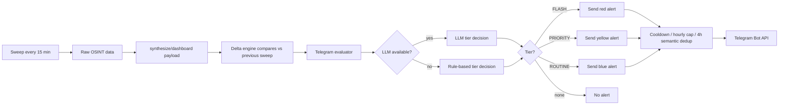

# Telegram Alerts Guide

How the Telegram alert system works, what it sends today, and how to tune cadence/content for personal use.

---

## TL;DR

- Alerts already fire automatically after every sweep (every `REFRESH_INTERVAL_MINUTES`, default 15).
- The bot also answers commands: `/status`, `/sweep`, `/brief`, `/alerts`, `/mute`, `/unmute`, `/help`.
- Send a manual test message any time with `npm run test:telegram`.
- An optional scheduled daily brief can be enabled via one env var.

---

## How alerts get triggered




The pipeline lives in [server.mjs](server.mjs) (sweep loop) and [lib/alerts/telegram.mjs](lib/alerts/telegram.mjs) (evaluator + dedup + bot polling).

---

## Alert tiers


| Tier         | Emoji  | Cooldown | Cap/hr | Fires when                                                                           |
| ------------ | ------ | -------- | ------ | ------------------------------------------------------------------------------------ |
| **FLASH**    | red    | 5 min    | 6      | Nuclear/radiological anomaly, or >=2 critical signals across market + conflict       |
| **PRIORITY** | yellow | 30 min   | 4      | >=2 high/critical signals escalating in the same direction, or OSINT surge (>=5 new) |
| **ROUTINE**  | blue   | 60 min   | 2      | Any single critical signal, or >=3 high-severity signals                             |


Defined in `[TIER_CONFIG](lib/alerts/telegram.mjs)` (~line 15). The same file holds the rule-based fallback (`_ruleBasedEvaluation`) that fires when the LLM is unavailable.

On top of the cooldowns, every alert is deduped against the last 4 hours of message content using a normalized SHA-256 hash, so near-duplicates (same headline, slightly different numbers) won't fire twice.

---

## What counts as a "signal"

The [delta engine](lib/delta/engine.mjs) compares each new sweep against the previous one. A metric becomes a signal once it moves by at least the threshold percentage (numeric) or count (count metric).

### Default thresholds


| Metric              | Threshold   | Source              |
| ------------------- | ----------- | ------------------- |
| VIX                 | +/- 5%      | FRED VIXCLS         |
| HY spread           | +/- 5%      | FRED BAMLH0A0HYM2   |
| 10y-2y spread       | +/- 10%     | FRED T10Y2Y         |
| WTI / Brent crude   | +/- 3%      | EIA / Yahoo Finance |
| Natural gas         | +/- 5%      | EIA / Yahoo Finance |
| Gold                | +/- 2%      | Yahoo Finance       |
| Silver              | +/- 3%      | Yahoo Finance       |
| Unemployment        | +/- 2%      | BLS                 |
| Fed funds           | +/- 1%      | FRED DFF            |
| 10y yield           | +/- 3%      | FRED DGS10          |
| USD index           | +/- 1%      | FRED DTWEXBGS       |
| 30y mortgage        | +/- 2%      | FRED MORTGAGE30US   |
| Urgent OSINT posts  | +/- 2 posts | Telegram channels   |
| Thermal detections  | +/- 500     | NASA FIRMS          |
| Aircraft tracked    | +/- 50      | OpenSky             |
| WHO alerts          | +/- 1       | WHO ProMED          |
| ACLED conflict evts | +/- 5       | ACLED               |
| ACLED fatalities    | +/- 10      | ACLED               |
| News items          | +/- 5       | RSS / GDELT         |


Severity ladder: a single threshold breach is `moderate`; >=2x threshold is `high`; >=3x is `critical`. Numeric moves above 10% always count toward `criticalChanges`.

---

## Bot commands

Tap the bot's menu or type any of these into the chat. Commands are case-insensitive.


| Command         | What it does                                                              |
| --------------- | ------------------------------------------------------------------------- |
| `/status`       | Uptime, last/next sweep, source count, LLM status, dashboard URL          |
| `/sweep`        | Triggers a manual sweep (fire-and-forget). Alerts will follow if any fire |
| `/brief`        | Compact text summary: delta direction, key prices, top OSINT, top ideas   |
| `/alerts`       | Last 10 alerts the bot has sent (tier + timestamp)                        |
| `/mute [hours]` | Silence reactive alerts. `/mute` = 1h, `/mute 4h` = 4 hours, etc.         |
| `/unmute`       | Resume reactive alerts                                                    |
| `/help`         | Print this command list                                                   |


Notes:

- `/mute` only silences **reactive** alerts. The scheduled daily brief still fires unless you set `TELEGRAM_DAILY_BRIEF_RESPECT_MUTE=true`.
- Commands only work from your configured `TELEGRAM_CHAT_ID`; messages from any other chat are ignored.

---

## Testing the wiring end-to-end

After changing the bot token, chat ID, network, or Docker setup, verify delivery without waiting for a real signal:

```powershell
docker compose exec crucix npm run test:telegram
# or, with a specific tier:
docker compose exec crucix npm run test:telegram FLASH
docker compose exec crucix npm run test:telegram PRIORITY
```

The script ([scripts/test-telegram.mjs](scripts/test-telegram.mjs)) bypasses the LLM evaluator and rate limits, formats a synthetic alert in the chosen tier, and sends it directly. If you see the message in Telegram within a few seconds, everything is wired correctly.

You can also run it on the host directly (no Docker needed) if you have node installed: `npm run test:telegram`.

---

## Scheduled daily brief (opt-in)

A once-daily digest separate from the reactive alert system. Set in `.env`:

```ini
# 24-hour local time, HH:MM
TELEGRAM_DAILY_BRIEF_TIME=07:00

# Optional IANA timezone. Defaults to the server's system timezone.
TELEGRAM_DAILY_BRIEF_TZ=America/New_York

# Optional: respect /mute. Default false (digest still fires when muted).
TELEGRAM_DAILY_BRIEF_RESPECT_MUTE=
```

Then rebuild and restart:

```powershell
docker compose up -d --build
docker compose logs crucix | Select-String "Daily brief scheduled"
```

On startup you'll see a log line confirming the next fire time. The brief content is identical to the `/brief` command: delta direction, VIX/WTI/Brent/Gold/Silver/NatGas, top OSINT urgents, and the top 3 LLM-generated trade ideas.

Implementation lives in `scheduleDailyBrief()` in [server.mjs](server.mjs). It uses `setTimeout` recomputed on every fire so daylight-saving shifts don't drift it.

---

## Recommended cadence for personal use

The balanced defaults are reasonable for a "background monitor" use case. After a week of live data you'll know whether you want to dial them.

Rough expectations with default thresholds:

- **FLASH:** rare. Only fires on genuine emergencies (nuclear anomaly, multi-domain critical event). Expect 0-1 per week, mostly during active geopolitical incidents.
- **PRIORITY:** ~1-3 per week. Fires on real market dislocations or coordinated OSINT surges.
- **ROUTINE:** ~5-15 per week. Includes notable single-domain moves like VIX > 5% or unemployment shifts.

If alerts start interrupting sleep or focused work, prefer `/mute 8h` over disabling tiers entirely.

---

## Tuning recipes

If after a week of real traffic the cadence feels wrong, paste one of these blocks into [crucix.config.mjs](crucix.config.mjs) and rebuild.

### Quieter preset (fewer routine alerts, only flag larger moves)

```js
delta: {
  thresholds: {
    numeric: {
      vix: 8,         // was 5
      hy_spread: 8,
      wti: 5,         // was 3
      brent: 5,
      gold: 4,        // was 2
      silver: 5,      // was 3
    },
    count: {
      urgent_posts: 4,        // was 2
      thermal_total: 1000,    // was 500
      conflict_events: 10,    // was 5
      conflict_fatalities: 25,// was 10
    },
  },
},
```

### Wider net (more sensitivity, more frequent alerts)

```js
delta: {
  thresholds: {
    numeric: {
      vix: 3,
      hy_spread: 3,
      wti: 2,
      brent: 2,
      gold: 1,
      silver: 2,
    },
    count: {
      urgent_posts: 1,
      thermal_total: 250,
      conflict_events: 3,
    },
  },
},
```

### Cap hourly noise without changing thresholds

If you like the signal detection but want fewer pings, edit `TIER_CONFIG` directly in [lib/alerts/telegram.mjs](lib/alerts/telegram.mjs):

```js
const TIER_CONFIG = {
  FLASH:    { emoji: '...', label: 'FLASH',    cooldownMs: 5 * 60 * 1000,  maxPerHour: 3 },  // was 6
  PRIORITY: { emoji: '...', label: 'PRIORITY', cooldownMs: 60 * 60 * 1000, maxPerHour: 2 },  // was 4 / 30min
  ROUTINE:  { emoji: '...', label: 'ROUTINE',  cooldownMs: 2 * 60 * 60 * 1000, maxPerHour: 1 }, // was 2 / 60min
};
```

### Disable a tier entirely

Set `maxPerHour: 0` for that tier. Useful if you only want PRIORITY+ and don't care about ROUTINE.

---

## Troubleshooting

**Bot is silent and `/status` doesn't respond.**

1. Check the server is up: `docker compose ps` should show `crucix-crucix-1` as Up.
2. Check the logs for `[Telegram] Bot command polling started`. If missing, your token is wrong.
3. Run `npm run test:telegram` — if that fails, the bot token or chat ID is wrong.

**Test message sends but real alerts never fire.**
This is expected during low-activity periods. To force a sweep, type `/sweep` in Telegram or hit `http://localhost:3117/api/data` to confirm the server is producing fresh data.

**LLM evaluator errors in the logs.**
Non-fatal — the system falls back to the rule-based evaluator (`_ruleBasedEvaluation` in [lib/alerts/telegram.mjs](lib/alerts/telegram.mjs)). Fix by either correcting `LLM_API_KEY` or accepting that all alerts will be rule-based.

**Daily brief never fires.**

1. Check log line `[Crucix] Daily brief scheduled for HH:MM (...) — first fire at ...` on startup.
2. Verify the time format is `HH:MM` (24-hour, zero-padded).
3. Verify `TELEGRAM_DAILY_BRIEF_TZ` is a valid IANA name (e.g. `America/New_York`, not `EST`).
4. If you set `TELEGRAM_DAILY_BRIEF_RESPECT_MUTE=true` and you're currently muted, it's silently suppressed — `/unmute` to confirm.

**Getting duplicates of the same news item.**
That's the semantic-dedup window expiring after 4 hours. If you want longer, change `fourHoursAgo` in `_isSemanticDuplicate` in [lib/alerts/telegram.mjs](lib/alerts/telegram.mjs).

---

## Files involved


| File                                                   | Role                                                                     |
| ------------------------------------------------------ | ------------------------------------------------------------------------ |
| [lib/alerts/telegram.mjs](lib/alerts/telegram.mjs)     | `TelegramAlerter` class: evaluator, dedup, bot polling                   |
| [lib/delta/engine.mjs](lib/delta/engine.mjs)           | `computeDelta`: produces the signals the alerter evaluates               |
| [server.mjs](server.mjs)                               | Wires alerter into sweep loop, registers commands, daily brief scheduler |
| [crucix.config.mjs](crucix.config.mjs)                 | Reads env vars into `config.telegram` and `config.delta`                 |
| [scripts/test-telegram.mjs](scripts/test-telegram.mjs) | `npm run test:telegram` manual test sender                               |
| [.env](.env)                                           | Bot token, chat ID, daily-brief settings (gitignored)                    |


---

## After any change, rebuild

Because source is baked into the Docker image (`COPY . .` in `Dockerfile`), code or config changes require:

```powershell
docker compose up -d --build
```

Plain `docker compose restart` will NOT pick up new code.